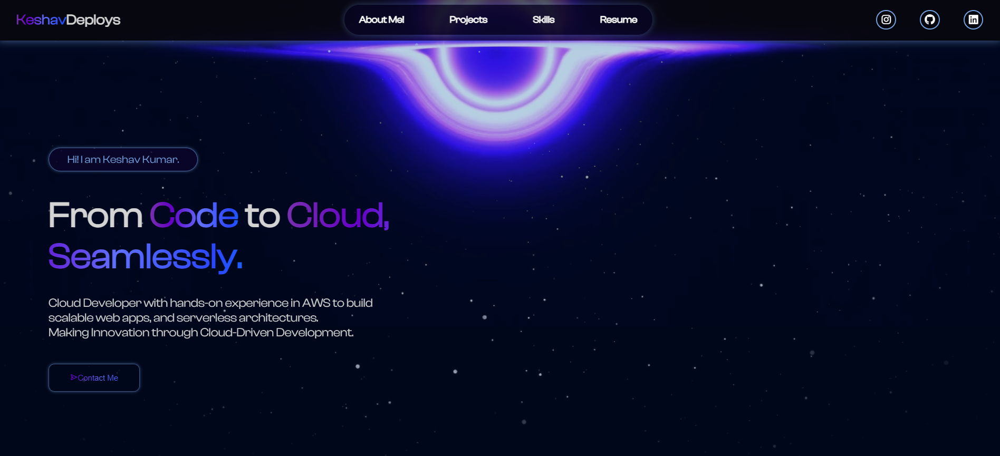

# 🚀 KeshavDeploys Portfolio

Welcome to my **personal developer portfolio**, where I showcase my cloud projects, tech stack, and web development skills — all built with ❤️ using HTML, CSS, and JavaScript.
> ⚡ _“From Code to Cloud, Seamlessly.”_
---

## 🌐 Live Site
🔗 [View Live Portfolio](https://zweely.github.io/Portfolio)

---

## 📸 Screenshots

### Desktop View  

## 🛠️ Built With

- **HTML5** – semantic structure
- **CSS3** – custom styling & responsive design
- **JavaScript (Vanilla)** – interactivity
- **Web3Forms** – for contact form integration
- **GitHub Pages** – for deployment
---

🎯 Features
🎥 Background video effects (galaxy + blackhole)
📱 Fully responsive (optimized for 480px and up)
🧩 Modular sections: Hero, About, Skills, Projects, Contact
📬 Contact form (Web3Forms)
🧠 Cloud branding, animation, and interactive design
🔗 GitHub repo buttons for each project

📬 Contact Me
Feel free to connect or collaborate:
LinkedIn
GitHub
Instagram

📝 License
This project is open source and free to use — feel free to fork, reference, or build on top of it!

Let me know if you’d like to add badges (like GitHub stars, last commit, etc.) or dark mode screenshots!
